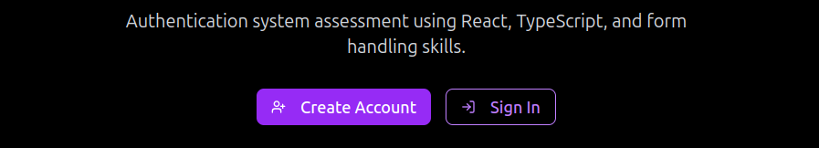
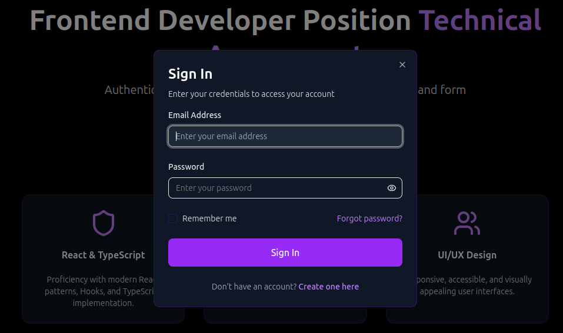
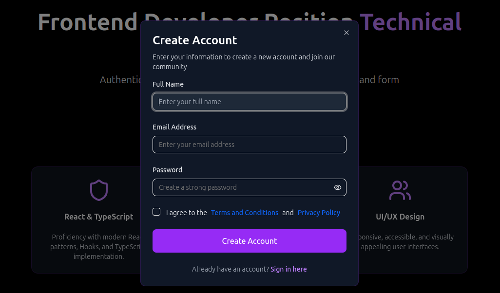

<div align="center">
  <a href="">
    
  </a>
  
  <h3 align="center">Authentication system assessment 🚀</h3>

  <p align="center">
    Authentication system assessment using React, TypeScript, Zod and React Hook Form.
  </p>
</div>

<details>
  <summary>Table of Contents</summary>
  <ol>
    <li>
      <a href="#about-the-project">About The Project</a>
      <ul>
        <li><a href="#built-with">Built With</a></li>
      </ul>
    </li>
    <li>
      <a href="#getting-started">Getting Started</a>
      <ul>
        <li><a href="#prerequisites">Prerequisites</a></li>
        <li><a href="#installation">Installation</a></li>
      </ul>
    </li>
  </ol>
</details>

## About The Project




### Built With

This project was developed using the following technologies:

- [![React][React.js]][React-url]
- [![TypeScript][TypeScript]][TypeScript-url]
- [![Tailwind-css][Tailwind-css]][Tailwind-url]
- [![Zod][Zod]][Zod]

## Getting Started

Prerequisites for installing and running the application locally.

### Prerequisites

- npm
  ```sh
  npm install npm@latest -g
  ```

### Installation

1. Clone the repo
   ```sh
   git clone https://github.com/andrewgerez/frontend-forms
   ```
2. Install NPM packages
   ```sh
   npm install
   ```
3. Run the local server
   ```
   npm run start
   ```

## Contact

Project Link: [https://github.com/andrewgerez/frontend-forms](https://github.com/andrewgerez/frontend-forms)

[TypeScript]: https://img.shields.io/badge/Typescript-blue?style=for-the-badge&logo=typescript&logoColor=white
[TypeScript-url]: https://www.typescriptlang.org
[React.js]: https://img.shields.io/badge/React-20232A?style=for-the-badge&logo=react&logoColor=61DAFB
[React-url]: https://reactjs.org/
[Tailwind-css]: https://img.shields.io/badge/Tailwindcss-white?style=for-the-badge&logo=tailwindcss&logoColor=61DAFB
[Tailwind-url]: https://tailwindcss.com/
[Zod]: https://img.shields.io/badge/ZOD-black?style=for-the-badge&logo=zod&logoColor=blue
[Zod-url]: https://zod.dev/
[Demonstration]: https://img.shields.io/badge/Demonstration-blue?style=for-the-badge
[Demonstration-url]: https://youtu.be/DJb8-016vi4
